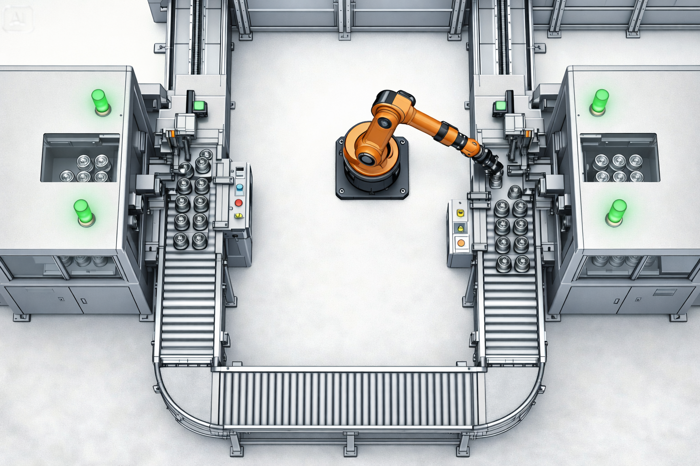
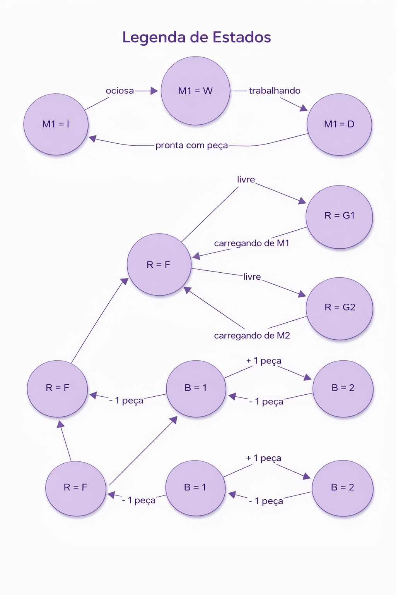

---

# __Célula de manufatura com robô compartilhado__
  

## 📜 Índice

- [Descrição do problema](#-Descrição-do-problema)
    - [Visão geral do sistem](#-Visão-geral-do-sistem)
    - [Problemas potenciais](#-Problemaspotenciais)
    - [Detalhamento dos componentes](#-Detalhamento-dos-componentes)
- [Visão do problema](#-Visão-do-problema)
- [Diagrama de blocos e explicação](#-Diagrama-de-blocos-e-explicação)
  - [Diagrama de Blocos](#-Diagrama-de-blocos)
  - [Figuras dos autômatos](#-Figuras-automatos)
  - [Link do video](#-link-videos)

---

  
# 🌟 Descrição do problema

* **Visão geral do sistema**
O sistema consiste em uma célula de manufatura automatizada composta por duas estações de processamento independentes (Máquinas 1 e 2), um sistema de transporte compartilhado (Robô Industrial) e uma esteira de saída com capacidade de armazenamento limitada (Buffer).

O objetivo do sistema é transformar matéria-prima bruta em peças acabadas e depositá-las na esteira de saída. O desafio principal do controle é coordenar o uso do robô compartilhado e gerenciar o fluxo de produção para evitar o transbordamento da esteira (overflow) e o bloqueio das máquinas (deadlock), garantindo que as operações ocorram em uma sequência lógica e segura.

* **Detalhamento dos componentes**
A seguir o funcionamento físico e lógico de cada componente da planta é descrito.

_A.Máquinas de processamento (M1 e M2)_
As duas máquinas são idênticas em funcionamento, mas operam de forma independente.

Funcionamento: a máquina parte de um estado de repouso. Ao receber um comando de início, ela começa a processar uma peça (assume-se que a matéria-prima está sempre disponível na entrada da máquina). O processo leva um tempo indeterminado. Ao finalizar o processamento, a máquina sinaliza que a peça está pronta e aguarda a retirada da mesma.
Restrições físicas:
A máquina não pode iniciar um novo ciclo de trabalho enquanto a peça anterior não for removida pelo robô (estado de "Peça Pronta" ou Done).
A máquina não pode ter a peça retirada se não tiver terminado o processamento.
_B. Robô industrial (Robô)_
O robô é o agente de transporte central da célula. Ele atua como o elo entre as máquinas e o buffer de saída.

Funcionamento: o robô parte de uma posição neutra, sem carga. Ele pode se mover até a Máquina 1 ou até a Máquina 2 para coletar uma peça processada. Após coletar a peça, ele se move até o Buffer de saída para depositá-la.
Restrições físicas:
Capacidade unitária: o robô só pode carregar uma peça por vez.
Sequenciamento: o robô não pode coletar uma peça se já estiver carregando uma. O robô não pode depositar uma peça se não estiver carregando uma.
Sincronia: o robô só pode realizar a ação de "pegar" (pick/get) se a respectiva máquina estiver no estado "Peça Pronta".
_C. Buffer de saída (Esteira)_
O buffer é uma esteira ou zona de armazenamento temporário onde as peças finalizadas são depositadas antes de serem levadas para o próximo setor da fábrica ou expedição.

Funcionamento: o buffer aceita peças trazidas pelo robô. As peças permanecem no buffer até que um agente externo (outro processo, operador humano ou empilhadeira) as remova.
Restrições físicas:
Capacidade limitada: o buffer possui um número finito de slots (posições). Para este projeto, define-se a capacidade = 2 peças  para evidenciar facilmente problemas de bloqueio.
Transbordamento (overflow): Não é fisicamente possível (ou é catastrófico) depositar uma peça se o buffer já estiver cheio.
Fluxo operacional e interações
O ciclo de operação nominal do sistema segue a seguinte lógica:
Um sinal é enviado para ligar a Máquina 1 e Máquina 2.
As máquinas processam o material e, eventualmente, seus sensores indicam o fim do processo (evento não-controlável). As máquinas param e ficam aguardando a retirada da peça.
O Robô, estando livre, desloca-se até uma máquina que tenha uma peça pronta.
O Robô retira a peça da máquina (liberando a máquina para iniciar um novo ciclo imediatamente, se desejado).
O Robô transporta a peça até o Buffer.
Se o Buffer tiver espaço livre, o Robô deposita a peça e volta ao estado livre.
Um evento externo remove a peça do Buffer, liberando espaço para futuras operações.

* **Problemas potenciais**
Sem um Supervisor (controlador lógico) adequado, o sistema está sujeito às seguintes falhas que o projeto deve evitar:
Colisão de recursos: o robô tentar pegar peças de M1 e M2 simultaneamente.
Violação de capacidade: o robô tentar depositar uma peça no Buffer quando este já está cheio, o que causaria danos à peça ou ao equipamento.
Bloqueio (deadlock):
Cenário: o Buffer está cheio. O Robô está segurando uma peça (aguardando o buffer liberar). As Máquinas M1 e M2 completaram suas peças e estão aguardando o Robô.
Consequência: se não houver garantia de que o Buffer será esvaziado (evento externo), o sistema trava completamente e nenhuma máquina pode produzir mais nada.
Tentativa de operação inválida: o comando de "Pegar peça da M1" ser enviado quando a M1 ainda está trabalhando (sem peça pronta).

---
### Visão do problema

A imagem abaixo retrata a visão do ambiente em que as máquinas (M1 e M2) e o rôbo estão inseridos.

---
### Diagrama de blocos e explicação

#### Diagrama de Blocos

$$ S = (Q, \Sigma, \delta, q_0, Q_m) $$

Onde:

- **Q**: Conjunto de estados
- **Σ**: Alfabeto de entrada
- **δ**: Função de transição
- **q₀**: Estado inicial
- **Qₘ**: Estados de aceitação

---

* O conjunto de estados é composto essencialmente pelos estados das máquinas ($$M_1$$ e $$M_2$$), robô e o buffer, logo em seguida temos uma ilustração em diagrama de blocos que especifica o comportamento do sistema.

* Devemos sintetizar o supervisor, será ele qo responsavel pelo correto funcionamento do sistema. O supervisor não permitirar que o sistema chegue a uma das especificações não desejadas do projeto.

### Estados dos Componentes (Vetor de Estado)

O vetor de estados global será uma tupla contendo o estado de cada um dos itens citados anteriormente, ou seja, ($$M_1$$, $$M_2$$, R, B).
- __M1, M2 (Máquinas)__: W (Working/Trabalhando), D (Done/Pronta), I (Idle/Parada e vazia).
- __R (Robô)__: F (Free/Livre e na posição neutra), G1 (Holding/Carregando peça da M1), G2 (Holding/Carregando peça da M2).
- __B (Buffer)__: $$B_0, B_1, B_2$$ (número de peças no buffer, capacidade máxima=2).
Devemos escolher os estados marcados, para usamos como base que um estado marcado é essencialmente a conclusão de tarefas como por exemplo a máquina 1 comcluiu a sua atividade. Os estados marcados listados abaixo.
- __Máquinaas__
    - Livre(Idle) e Concluido(Done)
- __Buffer__
    - Todos os estados são marcados pois temos que em todos os estados uma atividade foi conluida.
- __Robô__
    - Livre(free): Significa que ele já conluiu uma atividade ou está esperanndo as máquinas ligarem e concluirem suas atividades
Para exemplificar melhor, temos um exemplo abaixo que descreve as limitações e as trnsações que poderão ser realizadas pela máquina 1.

## Exemplo

* m1_start
  * Só é possível se M1 == I (máquina ociosa e vazia).
* get_m1
  * Só é possível se (M1 == D) and (R == F) (M1 pronta e robô livre).
* put_buffer
  * Só é possível se (R == G1 or R == G2) and (B < 2) (Robô carregando e buffer não cheio).
* buffer_out
  * Só é possível se (B > 0).

Efeitos das transições:

* Após get_m1:
    * M1 vai de D para I;
    * R vai de F para G1.
* Após put_buffer:
    * R vai de G1/G2 para F;
    * B é incrementado em 1.
* Após m1_done:
    * M1 vai de W para D.

###  Figuras dos Autômatos

### Máquina M1

### Máquina M2

### Robô

### Buffer

### Supervisor com apenas a máquina M1

### Suoervisor com as duas máquinas (M1 e M2)

### Link do video

https://youtu.be/SxyagKPxo1o

