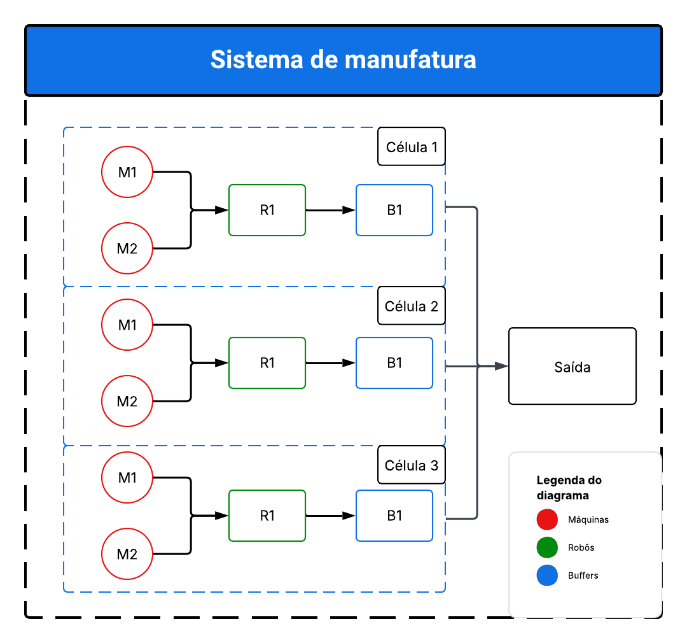
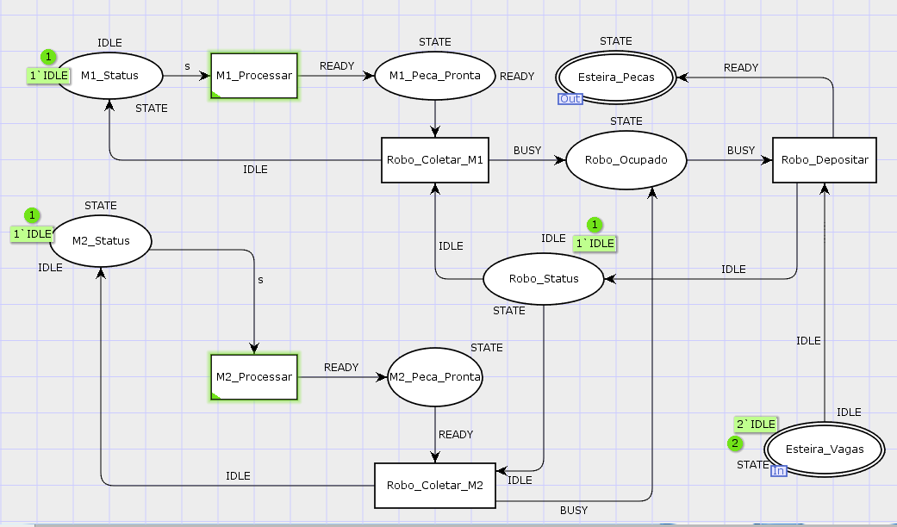
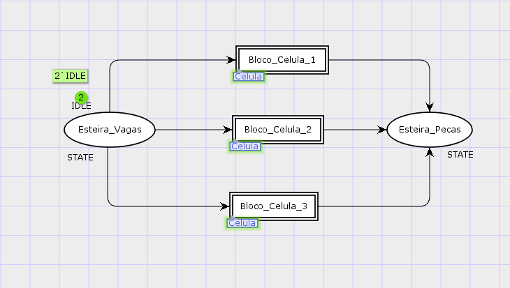

---

<div align="center">

# __Sistema de Manufatura usando Redes de Petri Hierárquicas (HCPN)__
  
</div>

# 📜 Índice

- [Introdução](#-introdução)
- [Descrição do Problema](#-Descrição-do-Problema)
- [Arquitetura e Diagrama de Blocos](#-Arquitetura-e-Diagrama-de-Blocos)
- [Descritivo Detalhado do Desenvolvimento](#-Descritivo-Detalhado-do-Desenvolvimento)
- [Imagens do Esquema](#-Imagens-do-Esquema)
- [Link do video](#-Link-do-video)

---

<div align="justify">
  
# Introdução
Este projeto apresenta a modelagem, simulação e controle de concorrência de um sistema de manufatura automatizado utilizando Redes de Petri Coloridas Hierárquicas (HCPN). O objetivo principal é garantir o roteamento correto de peças, evitar gargalos (overflow de buffers) e assegurar a exclusão mútua no compartilhamento de recursos físicos (robôs manipuladores) operando em um ambiente de produção paralela.

---

# Descrição do Problema

O sistema consiste em uma planta de manufatura composta por 3 células de produção independentes operando em paralelo. A arquitetura física de cada célula dita que:

  * Cada célula possui duas estações de processamento (Máquina 1 e Máquina 2).
  * Ambas as máquinas compartilham um único Robô manipulador para a coleta de peças finalizadas.
  * O robô deposita as peças em um Buffer de Saída (Esteira) que possui capacidade máxima limitada a 2 peças por vez.

**Desafios de Controle Resolvidos:**

  1. Exclusão Mútua: $M_{x}$ e $M_{y}$ não podem requisitar o robô simultaneamente.
  2. Prevenção de Deadlock: O sistema deve garantir que o ciclo de produção continue fluindo assim que os recursos forem liberados.
  3. Controle de Overflow: O robô deve ser bloqueado e impedido de depositar novas peças caso a esteira atinja sua capacidade máxima (2 peças).

---

# Arquitetura e Diagrama de Blocos

O modelo foi construído com uma abordagem Top-Down usando sub-páginas e soquetes de porta (Port-Sockets), isolando a lógica de controle da célula da arquitetura de roteamento da fábrica.

```
[ NÍVEL 1: FÁBRICA (Módulo Principal) ]
       |
       |---> [ Esteira de Vagas (In) ] ---> (Distribuição Paralela)
       |
       |---> [ BLOCO_CELULA_1 ] ---> [ Esteira de Peças (Out) ]
       |---> [ BLOCO_CELULA_2 ] ---> [ Esteira de Peças (Out) ]
       |---> [ BLOCO_CELULA_3 ] ---> [ Esteira de Peças (Out) ]

[ NÍVEL 2: CÉLULA (Submódulo Instanciado) ]
       |
       |--- [ M1_Processar ] ---> (Espera Robô) --|
       |                                          |---> [ Robo_Ocupado ] ---> [ Robo_Depositar ]
       |--- [ M2_Processar ] ---> (Espera Robô) --|

```



---

# Descritivo Detalhado do Desenvolvimento

A modelagem do sistema no CPN Tools foi dividida em quatro grandes fases, evoluindo de uma lógica sequencial simples para uma arquitetura hierárquica e paralela de manufatura.
  * Fase 1: Modelagem da Lógica Interna e Controle de Concorrência: O primeiro passo foi garantir o funcionamento perfeito de uma única célula de produção contendo duas máquinas operando simultaneamente.
    * Inclusão da Máquina 2 (M2): Foi desenhada a malha de estados da M2 (M2_Status $\rightarrow$ M2_Processar $\rightarrow$ M2_Peca_Pronta), espelhando a lógica estrutural da Máquina 1 (M1).
    * Compartilhamento de Recursos Físicos: Para representar que M1 e M2 dividem o mesmo robô, as transições de coleta de ambas as máquinas (Robo_Coletar_M1 e Robo_Coletar_M2) foram conectadas ao mesmo lugar central de controle de estado (Robo_Status).
    * Exclusão Mútua: Como o Robo_Status possui apenas um token (1'IDLE), o software garante matematicamente que apenas uma máquina possa requisitar o robô por vez, evitando conflitos de hardware.
  * Fase 2: Estruturação Hierárquica (HCPN): Para cumprir o requisito de múltiplas células sem poluir o ambiente visual, a lógica da célula foi encapsulada em um submódulo.
    * Definição de Portas (Ports): Na página original (renomeada para Celula), os lugares que interagem com o mundo exterior foram isolados. A Esteira_Pecas recebeu a etiqueta [Out] (saída de produtos) e a Esteira_Vagas recebeu a etiqueta [In] (entrada de capacidade de armazenamento).
    * Criação da Camada Superior: Foi criada uma nova página principal chamada Fabrica, que atua como o ambiente macro do sistema.
    * Instanciação (Assign Subpage): Na página Fabrica, criou-se uma transição de substituição (Retângulo de borda dupla) chamada Bloco_Celula_1, e a página Celula foi atribuída a ele, transformando toda a lógica desenhada anteriormente em um único "chip".
  * Fase 3: Conexão Físico-Lógica (Sockets) e Arquitetura Paralela: Com o molde da célula pronto, o sistema foi expandido para atingir a capacidade de produção exigida pelo projeto.
    * Mapeamento Porta-Soquete: Utilizando a ferramenta Assign port-socket, os pinos de entrada e saída da página Celula foram fisicamente soldados aos lugares correspondentes (Esteira_Pecas e Esteira_Vagas) na página Fabrica. Setas direcionais foram adicionadas na camada macro para garantir o fluxo correto do roteamento.
    * Expansão Horizontal: Foram instanciados mais dois blocos na página principal (Bloco_Celula_2 e Bloco_Celula_3), reaproveitando o código do submódulo Celula.
    * Roteamento em Paralelo: As três células foram conectadas em paralelo aos mesmos nós de entrada e saída. Isso significa que todas competem pelas mesmas vagas no buffer e depositam peças prontas na mesma esteira final, maximizando o fluxo contínuo.
  * Fase 4: Sincronização e Prevenção de Deadlock: A etapa final garantiu que a simulação de eventos discretos iniciasse corretamente, refletindo a realidade da fábrica.
    * Ajuste da Marcação Inicial: Ao transformar a Esteira_Vagas em um soquete na camada superior, o estado inicial do sistema passou a ser governado pela página Fabrica.
    * Correção de Abastecimento: Inseriu-se o valor 2'IDLE no lugar Esteira_Vagas da página principal. Isso inicializou o sistema com 2 vagas disponíveis no buffer compartilhado, impedindo um travamento imediato (Deadlock) do robô na tentativa de depositar a primeira peça processada.

--- 
# Imagens do Esquema





---

# Link do video

<div/>
